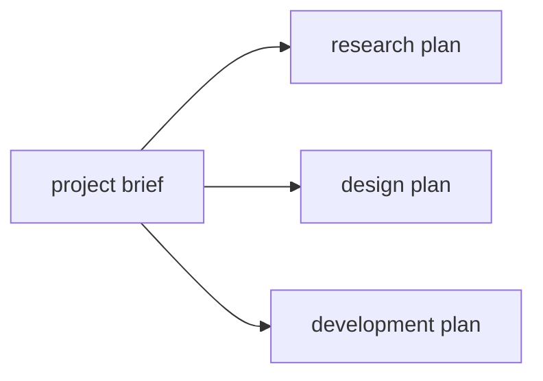

# HLD - 规划型测试仓库

## 架构

规划任务读取 `inputs/project-brief.md` 与工作文档，输出到 `plans/`。规划任务不执行研究、设计或开发本身。

```mermaid
flowchart LR
    A["project brief"] --> B["research plan"]
    A --> C["design plan"]
    A --> D["development plan"]
```

